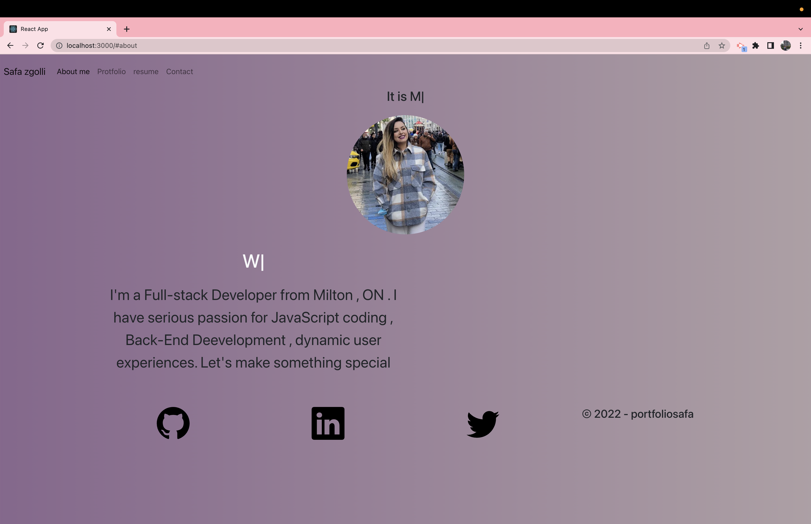

# React-portfolio:

## Description :

 * a single-page application portfolio for a web developer
- If I load the portfolio  I am presented with a page containing a header, a section for content, and a footer
- If I view the header I am presented with the developer's name and navigation with titles corresponding to different sections of the portfolio
- If I view the navigation titles I am presented with the titles About Me, Portfolio, Contact, and Resume, and the title corresponding to the current section is highlighted
- If I click on a navigation title I am presented with the corresponding section below the navigation without the page reloading and that title is highlighted
- If I load the portfolio the first time the About Me title and section are selected by default
- If I am presented with the About Me section I see a recent photo or avatar of the developer and a short bio about them
- If I am presented with the Portfolio section I see titled images of six of the developer’s applications with links to both the deployed applications and the corresponding GitHub repository
- If I am presented with the Contact section I see a contact form with fields for a name, an email address, and a message
- If I move my cursor out of one of the form fields without entering text I receive a notification that this field is required
- If I enter text into the email address field I receive a notification if I have entered an invalid email address
- If I am presented with the Resume section I see a link to a downloadable resume and a list of the developer’s proficiencies
-  If I view the footer
 I am presented with text or icon links to the developer’s GitHub and LinkedIn profiles, and their profile on a third platform (Stack Overflow, Twitter) 

 ## Picture for The portfolio
  * About me page:
  
  * Portfolio page:
  ! [ displays projects .](my-portfolio/src/assets/portfolio.png)
  * Resume page:
  ! [display the resume.](my-portfolio/src/assets/resum.png)
  * Contact page:
  ! [display the contact form.](my-portfolio/src/assets/cantact.png)

  ## Link to the app:

  deployed linK

  https://safazgolli.github.io/react-portfolio/

  ## Technologie used :

  * React.js
  * Javascript
  * JSX
  * Boostraps
  * React typical library
  * Bootstarps icon library
